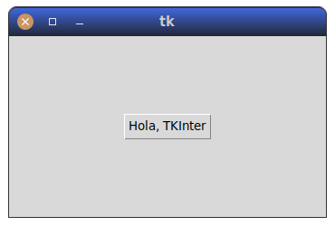
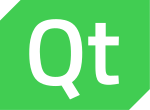
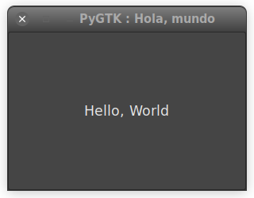
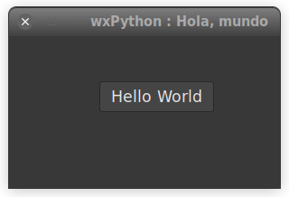
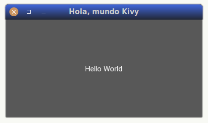

## Aplicaciones de escritorio

Una aplicación de escritorio es aquella que se encuentra instalado localmente
en el ordenador, y que presentan al usuario una interfaz gráfica que suele usar
metáforas comunes en todos los sistemas operativos modernos, como ventanas,
menús, controles, barras de desplazamiento, iconos, etc.

Una ventaja de las aplicaciones de escritorio es que, al estar instaladas
localmente, no requieren acceso a Internet para funcionar, y pueden aprovechar
mejor los recursos de la máquina sobre la que se están ejecutando. Entre los
inconvenientes, habría que destacar:

- Normalmente son **más complicadas de desarrollar**.

- Dependiendo de la tecnología usada, **puede que solo funcionen en una
  plataforma** determinada.

- No es fácil propagar Los cambios en el programa, normalmente implican
  **volver a instalarlo**.

Se pueden escribir aplicaciones de escritorio con cualquier lenguaje moderno,
lo que incluye por supuesto a Python. Además, al ser Python multiplataforma,
los _frameworks_ y librerías para desarrollos de escritorio también suelen ser
multiplataforma, lo que nos permite tener la misma aplicación, o con pequeñas
diferencias, funcionando en Windows, Linux o Mac.


## Opciones para el desarrollo de aplicaciones de escritorio en Python

En Python existen muchas librerías y _frameworks_ de desarrollo de aplicaciones
de escritorio, cada una con sus ventajas e inconvenientes. En el siguiente
listado podemos ver algunas de las más habituales, y comentaremos ventajas e
inconvenientes de cada una de ellas.  Entre los factores que consideraremos
están la facilidad de instalación y uso, la capacidad multiplataforma, los
controles incorporados y la integración con el sistema operativo, es decir, si
la aplicación tiene el comportamiento y el aspecto de aplicación normal en ese
entorno:

## TK/TKInter


[**TK/tkinter**](https://docs.python.org/es/3/library/tkinter.html) Es la
opción mas básica, y tiene la gran virtud de que viene instalada de serie, es
una de las librerías estándar de Python (Excepto en Mac, pero eso es por sus
historias). Pero no es muy buena en el aspecto estético ni en la integración con
el sistema operativo.

Este ejemplo en tkinter:

```python
--8<--
docs/hola-tkinter.py
--8<--
```

Debería producir esta ventana:



!!! note "Notas de instalación"

    Si no estuviera instalado, ejecutar
    ```
    sudo apt install python3.8-tk
    pip install tk
    ```


## pyQT6



[**Qt6**](https://pygobject.readthedocs.io/en/latest/index.html) (PyQt5, pyQt6,
PySide) es un _binding_ de la biblioteca gráfica Qt para Python.  La biblioteca
está desarrollada por la firma británica _Riverbank Computing_ y está
disponible para _Windows_, _GNU/Linux_ y _Mac OS/X_ bajo diferentes licencias.

Entre sus muchas ventajas destaca su potencia y amplio número de
controles, así como una integración muy buena con el sistema operativo. Antes
era un poco más complicado de instalar en _Windows_ pero se ha mejorado mucho
en ese aspecto. Es una instalación algo pesada, pero es un _framework_ de
muchísima calidad, muy probado y muy potente.

Ejemplo En Qt6:

```python
--8<--
./docs/hola-qt6.py
--8<--
```

Debería producir algo parecido a:


    
## pyGTK


[**pygtk3**](http://pygtk.org/) GTK o _The GIMP Toolkit_ es una
biblioteca de componentes gráficos multiplataforma para desarrollar interfaces
gráficas de usuario (_GUI_). Está licenciado bajo los términos de la _GNU
LGPL5_, por lo que permite la creación de tanto software libre como software
privativo. **PyGTK** es un _binding_ de la biblioteca gráfica _GTK_ para el
lenguaje de programación Python. La biblioteca _GTK_ se usa para desarrollar el
entorno gráfico _GNOME_, así como sus aplicaciones, a la vez que algunos otros
entornos gráficos.


Ejemplo en Gtk:

```python
--8<--
./docs/hola-gtk.py
--8<--
```

Daría como resultado:



!!! note "Notas de instalación"
    
    ```
    sudo apt install libgirepository1.0-dev gcc libcairo2-dev
    sudo apt install pkg-config python3-dev gir1.2-gtk-3.0 libxt-dev
    sudo pip install pycairo PyGObject
    ```

## WxPython


Con **[wxPython](https://wxpython.org/)** tenemos unas
librerías de desarrollo multiplataforma, que nos permiten crear aplicaciones
que utilizan realmente las interfaces nativas de cada sistema, de forma que
nuestras aplicaciones pueden ejecutarse sobre Windows, MacOS o GNU/Linux con
pocas o ninguna modificación. Como aspecto negativo, la funcionalidad  está
limitada al mínimo común de todas las plataformas.

Ejemplo en WxPython:

```python
--8<--
./docs/hola-wx.py
--8<--
```

Daría como resultado:




## Kivy


El último, pero no menos importante, [**Kivy**](https://kivy.org/) es un
_framework_ Python gratuito y de código abierto para desarrollar aplicaciones
móviles y otro software de aplicación multitáctil con una interfaz de usuario
natural. Se distribuye según los términos de la licencia _MIT_ y se puede
ejecutar en Android, iOS, GNU/Linux, Mac OS/X y Windows.

Es fácil de instalar, pero la integración estética con el sistema Operativo no
es la mejor. De hecho, toman la dirección contraria: se pretende que la
estética de los aplicaciones hechas en Kivy sean idénticas en todas las
plataformas.  Sus principales virtudes son el poder desarrollar, además de para
las plataformas de PC, para móviles Android o iOS. Es relativamente sencillo de
instalar. Define un lenguaje propio para separar la representación del código
de la aplicación.

Vamos a trabajar con más profundidad en Kivy, por varias razones, la primera la
facilidad de instalación, y por otra la potencia que nos da el poder realizar
aplicaciones incluso para el móvil, que es su principal punto fuerte. Perdemos,
por otro lado, la integración con el sistema operativo; veremos que los
controles habituales como botones, barras de desplazamiento, menús, etc. son
diferentes de los nativos de la plataforma.

Ejemplo en kivy:

```python
--8<--
docs/hola-kivy.py
--8<--
```

Debería producir algo similar a:



## Cosas en comun entre las distintas soluciones

Como vemos, a pesar de las diferencias, hay mucho en comun en todas las
versiones:

1) Normalmente tenemos el concepto de **App** que representa la aplicación en
si, de la cual solo hay una instancia, y luego tenemos algún tipo de ventana.
En los ejemplos mostrados solo se crea una ventana, pero lo normal es tener
varias ventanas disponibles, de las cuales una es la principal

2) Los componentes dentro de una ventana se agrupan en forma de árbol,
existiendo un componente raiz.

3) se usan componentes estándar, como etiquetas o botones, Además de lo visto
en los ejemplos, tenemos más tipos de controles que podemos encontrarnos:

- La etiqueta.

- El botón.

- La lista de elementos.

- Entrada de texto.

- El _ComboBox_ o _Combo_: Una combinación de entrada de texto y lista. Normalmente
  se muestra como un cuadro de texto acompañado por una flecha que despliega
  la lista de opciones.

- _Radio Buttons_.

- _Checkboxs_

La mayoría de estos tipos de controles ya estaban disponibles en la primera
plataforma gráfica que soportaba en _SmallTalk-76_.


4) Normalmente hay una fase previa de preparación de los controles y ventanas
necesarios, para luego ceder finalmente el control al propio framework. A
partir de ahí, sera este el que invocará a nuestros funiones o métodos en base
a las acciones del usuario. Esto se conoce generalmente como programción
orientada a eventos.

**Pregunta** Tanto la opción de checkbox como los radio buttons nos permite
marcra opciones de tipo binario o Si/No. ¿Cuál es la diferencia entre ellas?


**Respuesta**: Las diferentes opciones, si se usan checkbox, son independientes
entre si, pero si se usan radio buttons, entonces las distintas opciones son
mutuamente excluyentes entre si, es decir, solo puede haber una seleccionada.

Estas convenciones y muchas más que reconocemos aun sin darnos quiza cuenta ,
como por ejemplo la tacla F1 para la función de ayuda, cerrar una ventana con
Alt-F4, etc. fueron definidas en un documento llamada [Common User
Access](https://en.wikipedia.org/wiki/IBM_Common_User_Access) definido por IBM
a finales de los 80. Junto con la guia de Apple [HIG Human interface
guidelines](https://en.wikipedia.org/wiki/Human_interface_guidelines) son
documentos que convien por lo menos repasar para no romper las reglas que la
mayoría de usuarios esperan encontrar en un programa.


### Bibliografía y referencias

- [Kivy: Cross patform framework for GUI apps development](https://kivy.org/)

- [wxPython](https://www.wxpython.org/)

  - wxPython 2.8 Application Development Cookbook, Cody Precord (Packt
    Publishing)

    - [Packt Publishing](https://www.packtpub.com/product/wxpython-2-8-application-development-cookbook/9781849511780)

    - [Amazon](https://www.amazon.es/Wxpython-2-8-Application-Development-Cookbook/dp/1849511780)

- [The Python GTK+ 3 Tutorial](https://python-gtk-3-tutorial.readthedocs.io/en/latest/)
