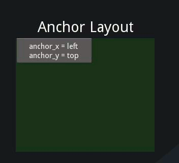
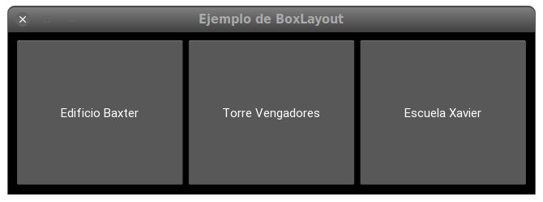
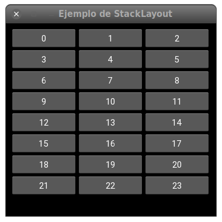

## Introducción a kivy Layouts


Los _Layouts_ son controles especiales, que se ocupan de disponer en el espacio
que tengan disponible los controles que contengan. Hay varios tipos de
_layouts_, cada uno dependiendo de la estrategia que use para la disposición de
los controles.

## AnchorLayout

Ya vimos en el tema anterior un ejemplo, el `AnchorLayout`. Este nos permite
colocar los controles que queramos o bien pegados a uno de los bordes o en el
centro. Para ello usa los parámetros `anchor_x` y `anchor_y`, cuyos valores
posibles son: para `anchor_x`, `left`, `center` o `right`, mientras que para
`anchor_y` son `top`, `conter` o `button`.

En la siguiente imagen podemos ver como dispone un control dependiendo de estos
posibles valores:



Hay otro parámetro en _AnchorLayout_ que no vimos, pero que es interesante
porque se usa también en muchos otros _layouts_, se trata de la propiedad
**`padding`**. El _padding_ es el espacio que separa los límites del contenedor con
los propios controles que contenga, en pixels.

Normalmente se usa una tupla de cuatro elementos para indicar el _padding_ de
cada lado por separado: `[padding_left, padding_top, padding_right,
padding_bottom]`, pero también se puede usar una tupla de dos elementos, que
serían el _papdding_ horizontal y vertical: `[padding_horizontal,
padding_vertical]` o incluso un único valor, que seria el _padding_ a usar en
todos los lados.  El valor por defecto es $[0, 0, 0, 0]$.

### BoxLayout

La verdad es que la utilidad de `AnchorLayout` no es muy grande, porque
simplemente pone todos los controles en el mismo sitio. `BoxLayout` es más
útil, porque lo que hace es disponer todos los controles que contenga en
secuencia, ya sea en una disposición horizontal como en una vertical.

El parámetro `orientation` define precisamente este sentido de la disposicin.
El valor por defecto, `horizontal`, dispondra los controles de izquierda a
derecha. El otro valor posible, `vertical`, los dispondrá de arriba a abajo.

Aparte de `padding`, que se usa igual que como vimos en el `AnchorLayout`
también se define la propiedad `spacing`, que define el espacio a dejar entre
los controles dentro del _layout_:

Veamos el siguiente ejemplo, donde dispondremos varios botones en un
`BoxLayout` horizontal.

```python
--8<--
docs/box-layout-example.py
--8<--
```

Debería producir algo como esto:



**Ejercicio:** Modificar el ejemplo anterior para que los botones se dispongan 
de forma vertical, no horizontal, e incrementar el espacio entre los botones
a 25 pixels.

Cosas interesantes a comentar en este ejemplo:

En primer logar, obsérvese que hemos agrupado todos los `ToggleButton`, usando
el mismo valor (`'hq'` en este caso) para la propiedad `group`. Como se comentó
cuando vimos este control, esto hacen que sean mutuamente excluyentes entre si,
de forma que en cuanto seleccionamos un botón, si hubiera otro seleccionado se
_deseleccionará_ automáticamente. Comenta o cambia el parámetro `group` en uno de
los controles para ver que ese control puede ahora activarse o desactivarse de
forma independiente de los demás.

En segundo lugar, vemos que el `BoxLayout` se ocupa de distribuir el espacio
entre todos los controles, de forma que ocupen todo el espacio disponible. Si
estamos en una disposición horizontal, respetará lo que se haya definido en la
propiedad `size_hint`, pero **solo** en el primer parámetro. Como el valor por
defecto de `size_hint` es $(1, 1)$, significa que distribuirá de forma
equivalente el espacio disponible entre todos los controles, ya que todos
tienen un $1$.

**Ejercicio**: Cambiar la propiedad `size_hint` de uno de los botones
para que sea $(0.5, 1)$. ¿Qué pasa? Cambiar ahora a $(2, 1)$. ¿Por qué?

De forma análoga, si la disposición es vertical, el _layout_ hará caso ahora
del segundo valor de la tupla `size_hint`, e ignorará el primero.

Con respecto a los valores de `pos_hint`, _BoxLayout_ también los tendrá en
cuenta, pero igualmente de forma selectiva. Si la disposición es horizontal,
atenderá a los valores en las claves `y`, `top` y  `center_y`, ignorando el
resto.  En caso de disposición vertical, atenderá a `x`, `right` y `center_x`,
e ignorará el resto.

**Ejercicio**: Añade más controles al ejemplo. Observa como `BoxLayout` se
encarga de distribuirlos todos.


```python

```

Fichero kivy:

```python

```

**Ejercicio**: Añadir un par mas de botones. Ver que el orden se corresponde con
el orden en que se añadieron los *widgets*

## GridLayout

El `GridLayout` dispone sus controles en forma de parrilla. Toma el espacio
disponible y lo distribuye en filas y columnas, y luego coloca los controles en
las _celdas_ resultantes. Al crear el _layout_ es obligatorio especificar al
menos una de las dos propiedades `rows` o `cols`. Obviamente, también se pueden
definir ambas, pero nos dará error si no definimos ninguna.

Las propiedades `size_hint_x` y `size_hint_y` serán tenidas en cuenta, el resto
ignoradas. Como por defecto no están definidas, se dará el mismo espacio a cada
control.

Las propiedades `padding` y `spacing`, vistas anteriormente, también están
disponibles.

Veamos un ejemplo:

```python
--8<--
docs/grid-layout-example.py
--8<--
```

La posición de cada control en cada celda se hace de forma automática,
atendiendo al orden de definición. 


## StackLayout

Con `StackLayout` los controles se van disponiendo de forma verical u
horizontal, segun este definidio con el parámetro `orientation`, hasta que una
fila o columna se llena, en cuyo momento se pasa a la siguiente.

Los valores posibles de `orientation` son:

- `lr-tb`: _left to right, then top to buttom_
- `tb-lr`: _top to button then left to right_
- `rl-tb`: _right to left, then top to bottom_
- `tb-rl`: _top to bottom, then right to left_
- `lr-bt`: _left to right, then bottom to top_
- `bt-lr`: _bottom to top, then left to right_
- `rl-bt`: _right to left, then bottom to top_
- `bt-rl`: _bottom to top, then right to left_

Vaemoslo con el siguiente ejemplo.

```python
--8<--
docs/stack-layout-example.py
--8<--
```

Ejecutalo con 
```shell
python stack-layout-example.py --size 360x330
```

Debería producir algo como:



Cambia ahora el tamaño de la ventana y observa como los botones se
redistribuyen en función del espacio disponible.

**Ejercicio**: Hacer los botones más anchos. Añadir más botones, Ver lo que pasa. Cambiar la orientación.

## FloatLayout

Este _layout_ simplemente respeta lo que haya definido en 
lo que haya definido en las propieadades `size_hint` y `pos_hint`, sin más
restricciones. Estos valores generalmente no se respetan a no ser que están
dentro de algun _Layout_

Las propiedades `size_hit` y `pos_hist` trabajan con coordenadas
proporcionales, de forma que sus valores siempre están comprendidos entre $0$ y
$1$. La coordenada $0, 0$ serían las correspondientes a la esquina inferior
izquierda. Recordemos que Kivy usa un sistema de coordenadas diferente al que vimos en _Pillow_ o en _CSS_ por ejemplo, aquí el cero para la coordenada `Y` está
abajo.

La coordenada $1, 1$ corresponderían, porl o tanto, con la esquina superior derecha.

La propiedad `pos_hint` es similar, pero en vez de pasarle una tupla se le pasa
un diccionario, donde dependiendo de la clave ('x' o 'top' por ejemplo)
conseguimos uno u otro resultado: `x` se refiere siempre al borde izquierdo.


Veamos el siguiente ejemplo, donde hemos creado una serie de botones
y hemos ajustado las posiciones para poner uno en la esquina inferior
izquierda, otro en el centro, y otro en la esquina superior derecha:

```python
--8<--
docs/float-layout-example-before.py
--8<--
```

Vemos que se posicionan bien, pero no son reactivos, ni se mueven cuando se
escala la ventana ni cambian su tamaño. De nada nos serviria interntar usar
`pos_hint` ni `size_hint` porque estas porpiedades no se contenplan dentro de
un `Widget` normal.

Pero si en vez de colocar los botones dentro de un `Widget`, usamos un
`FloatLayout`, ya podemos usar `pos_hint` y/o `size_hint` sin problemas, y
obtenemos una versión que responde a cambios de tamaño de la ventana:

```python
--8<--
docs/float-layout-example-after.py
--8<--
```

# RelativeLayout

Funciona de forma similar al `FloatLayout`, pero las propiedades
relativas a la posición (`pos`, `x`, `center_x`, `right`, `y`, `center_y` y
`top`) son relativas al tamaño del control, no al tamaño de la ventana.

Aunque estas propiedades simplifican mucho el posicionamiento, avitando calculos
y haciedo el codigo mas claro, seguimos pudiendo usar los valores `x` w `y`
para posicionar los widgets. Por ejemplo, `{'x': .85, 'y': 0}` pondria la x del control al 86 por cierto del ancho total disponible.

## PageLayout

PageLAyout.Uso. Cambiar color de los botones para poder apreciar mejor el cambio depagina

## Uso del lenguaje Kivy (kvlang)

Kivy define un lenguaje propio, llamado a menudo **kvlang**, con el propósito
de definir la organización, disposición o *layout* de los controles en las
pantallas. No es estrictamente necesario usar este lenguaje, pero es verdad que
en muchos casos se simplifica mucho esta parte.

Podemos organizar la disposión o _layout_ de nuestras ventanas usando Python
directamente o a traves de este lenguaje. No hay nada que podamos hacer en este
lenguaje que no podamos hacer con Python, y sin embargo, no es así al reves,
algunas cosas que podremos hacer en Python no podremos hacerlas en kvlang, por
ejemplo, la creación dinámioca de controles. Así, es conveniente usarlo, porque
si que es verdad que algunas cosas son más fáciles de hacer en kvlang que en
Python.

Vamos a empezar modificando el programa anterior. Vamos a dividirlo en dos, el
programa en si y un fichero con extensión `.kv` que define la disposición o
_layout_ de la interfaz:

Este sería el código Python inicial:

```python
from kivy.app import App
from kivy.uix.button import Button

class MainApp(App):

    def build(self):
        self.btn = Button(
           text="Hello World",
           size_hint=(0.4,0.05),
           pos_hint={'x': 0.3, 'y': 0.5}
           )
        return self.btn


def main():
    app = MainApp() 
    app.run()
```

Lo primero que necesitamos saber es que Kivy tiene una regla por defecto para
vincular el programa Python con el fichero .kv a utilizar para la disposición
o *layout*. Tampoco es estrictamente necesario seguir esta regla, solo es una
ayuda, pero la mayoría de los programas lo hacen así, porque resulta muy
cómodo.

La regla es la siguiente: Dentro de nuestro programa, habrá un único elemento,
que representa la aplicación, y que será o bien una instancia de la clase `App`
directamente o, mas frecuentemente, una instancia de una clase derivada de
`App` (En el ejemplo, es la clase `MainApp`).  En ese caso, Kivy tomara el
nombre de la clase, le quitara en sufijo `App` si lo tuviera, pasará el resto a
minúsculas (En nuestro caso, `main`), y buscará un fichero con ese mismo nombre
y la extensión '.kv'. En nuestro ejemplo, buscará un fichero llamado `main.kv`.

Vamos entonces a guardar el fichero de ejemplo como `main.py`. Ahora vamos a
especificar la disposición de nuestros controles en un fichero,

```kvlang

```

y en otro `main.py`:

```python

```

Algunas cosas a tener en cuenta:

1) Ya no hace falta que importemos `Button`, pues será instanciado a partir del
fichero `.kv`.

2) El método `builder` tampoco hace falta. Normalmente es el encargado de
construir el _layout_ de la aplicación en el inicio, pero en este caso se
generará también de forma automática a partir del contenido del fichero
`main.kv`.

### Estructura de los ficheros `.kv`

Fichero kivy -> reglas

parte izquierda: identificadores
parte derecha: codigo python
nunca se usa =


**Ejercicio**: Añadir un control de tipo _Label_ con el texto "Que tal"

Añadir Label. Que pasa? Error. Solo es posible tener un único elemento
raiz.

