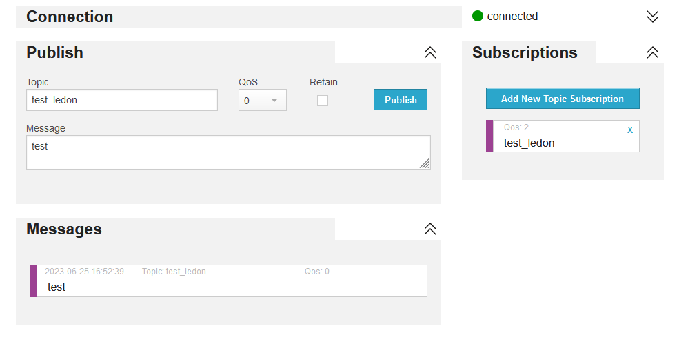

# MQTT

Otra forma de enviar o recibir información, es utilizar el protocolo ligero MQTT.

El protocolo MQTT, se basa en el principio productor-consumidor. Por un lado, pueden publicarse mensajes con una información y un "topic".

Por otro lado, puedes suscribirte a un tema o "topic" para recibir todo lo que se reciba sobre dicha información.

Esto hace que el protocolo MQTT sea muy utilizado ya que es muy ligero y muchos componentes lo utilizan.

Normalmente, se utilizan brokers que son los servidores que reciben y envía la información necesaria.

En primer lugar, vamos a ver como instalar el cliente mqtt; en este caso usando la utilidad upip.

```python
import upip
upip.install('micropython-umqtt.simple')
```
**NOTA:** Recuerda que tienes que tener conexión a Internet.

Para estos ejemplos, usaremos el broker publico [https://www.hivemq.com/demos/websocket-client/](https://www.hivemq.com/demos/websocket-client/).

Aquí podemos ver un ejemplo; donde publicar o suscribirnos a un tema.



La librería umqtt, nos permitirá conectar al broker de manera sencilla:

[https://pypi.org/project/micropython-umqtt.simple/](https://pypi.org/project/micropython-umqtt.simple/).

Veamos como se utiliza:

```python
client = MQTTClient(id_cliente, mqtt_server)  # si no decimos nada usa el puerto por defecto 1883
client.set_callback(mqtt_callback)  # cuando entren mensajes por los topics a los que estamos suscritos, dispara el callback
client.connect()#Conectar al broker
client.suscribe('clase_eoi')#nos suscribimos al tema en concreto.
client.publish(b'clase_eoi', mensaje) #Envia la información al broker.
```

Puedes ver el ejemplo completo en este [enlace](B07_MQTT/main.py).

**Ejercicio adicional 1**
A partir de este ejemplo, cuando se pulse un botón enviar un mensaje por MQTT.

**Ejercicio adicional 2**
Suscribirse al tema "temperatura_eoi" y enviar la información de la temperatura usando la API de open Meteo.

**Ejercicio adicional 3**
Controlar usando MQTT, los colores de un led RGB; enviando el siguiente json:

```json
{
    "r":255,
    "g":0,
    "b":0
}

Suscribirse a un tema, y cambiar el color del led.